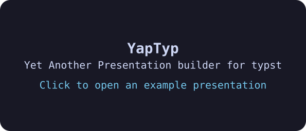

# YapTyp

This is Yet Another Presentation builder for Typst, the key differences from the rest are:
- it generates HTML, not PDF
- it allows inserting videos into the presentation
- it allows opening a window with speaker notes (like impressjs)

Things worth keeping in mind:
- but does not support animations (yet)
- if the notes are longer than an A6 page, they will overflow and currently break the presenter's view

## Project Status
This was built in one day, I do intend to keep working on it,
though it does pretty much everything I want it to do for now.
If you have any suggestions, please open an issue or write me an email.

## Requirements

The system should have typst and some kind of shell.
If you have Nix, you can run `nix-shell`.

## Getting Started

1. Clone the repo `git clone https://github.com/snlxnet/YapTyp test-presentation`
2. `cd test-presentation`
3. Modify `content.typ`
4. run `./bundle.sh`

## Usage notes

Everything must be contained in `#slide` or `#notes` blocks, no top-level content.
Other that, the project is rather unopinionated, you can style / change it however you see fit.

- `#slide` is a page that shows in the main view,
- `#notes` is a page that shows in the presenter view,
- if the notes are longer than an A6 page, they will overflow and currently break the presenter's view
- to insert a video, use `#player()<filename>`, the file has to be in the project directory
- `#player` is actually just a `#box` with some defaults, so it takes the same arguments

## Credits

- The [typst](https://typst.app) compiler is the heart of this project
- [Catppuccin](https://github.com/catppuccin/typst) is the theme used for speaker notes by default
- `demo.webm` is from WikiMedia Commons, [source](https://commons.wikimedia.org/wiki/File:Butterfly_catastrophe_animation.webm)
