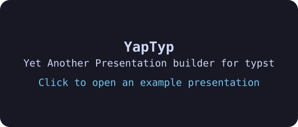

# YapTyp

Browser-optimized paged export for Typst.

Add videos and interactive speaker notes to your Typst documents.

## Usage
TODO

## Background
YapTyp was initially built for my talk at the uni.
The idea was that different versions of PowerPoint and LibreOffice
handle videos and speaker notes differently, but the browser is the same everywhere.

It works by inserting `<labels>` into the SVG,
then reading them and replacing the elements that have them
with `<foreignElement>`.

